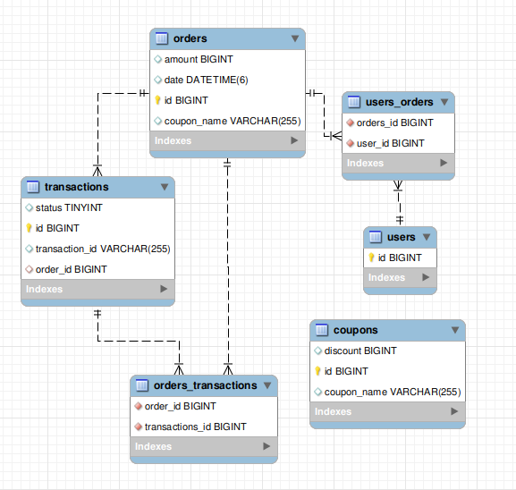

## Getting Started

1. **Clone the Repository:**
   ```bash
   git clone https://github.com/AryanP45/Shopping-App
   cd Shopping-App
   ```

2. **Set Up Backend:**
   - Configure your MySQL database settings in the `application.properties` file.
   - Run the Spring Boot application.


## Database ER Diagram


## Assumptions
- I assumed only single product as mentioned in problem statement.